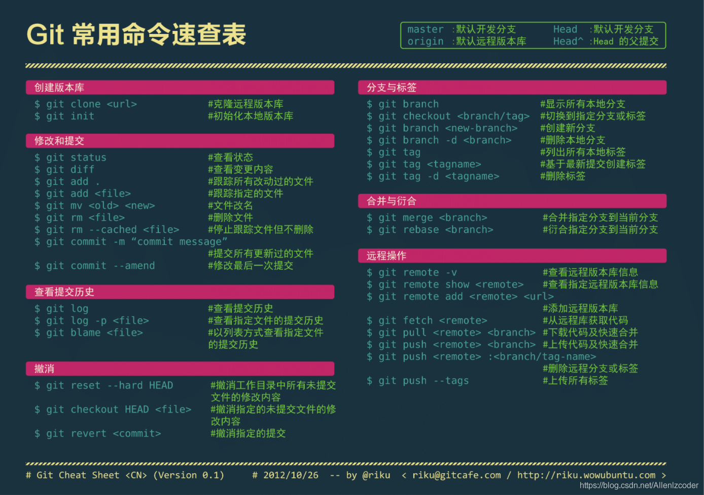

# Git命令



# Git的四个库

* git一共有四个区域，工作区，本地缓存库，本地版本库和远程版本库
* git add就是将文件添加到本地缓存库
* git commit将本地缓存库提交到本地版本库
* git pull将本地版本库提交到远程版本库

# .gitignore文件

* 我们做的每个Git项目中都需要一个“.gitignore”文件，
* 这个文件的作用就是告诉Git哪些文件不需要添加到版本管理中。
* 比如我们项目中的npm包(node_modules)，它在我们项目中是很重要的，但是它占的内存也是很大的，所以一般我们用Git管理的时候是不需要添加npm包的。

# .gitignore规则的写法

```
/mtk/ 过滤整个文件夹
*.zip 过滤所有.zip文件
/mtk/do.c 过滤某个具体文件
```

* 常用的gitignore可以参考github官方的项目[A collection of useful .gitignore templates](https://github.com/github/gitignore))

# .gitignore文件无效的解决方法

* gitignore只能忽略那些原来没有被track的文件，如果某些文件已经被纳入了版本管理中，则修改.gitignore是无效的。
* 想要.gitignore起作用，必须要在这些文件不在暂存区中才可以，.gitignore文件只是忽略没有被staged(cached)文件，

```
git rm -r --cached .
git add .
git commit -m "update .gitignore"
```

# 参考

[.gitignore](https://www.jianshu.com/p/699ed86028c2)
[git上传项目命令方式](https://www.cnblogs.com/godlove/p/11769572.html)