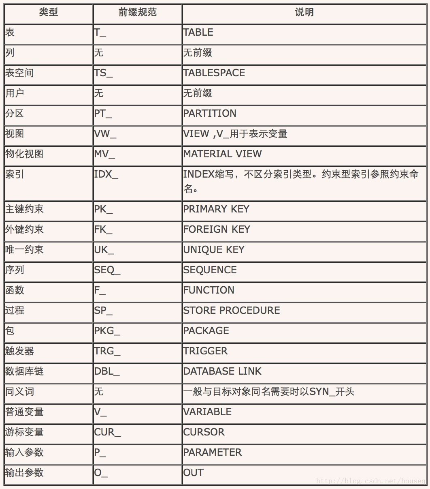

# 基本命名原则
以下基本原则适用于所有数据库对象命名，如无特别说明则为强制规范。

Ø规范：遵循行业规范

* 当有相关国家/行业强制性数据结构标准规范存在时，用于存储某业务数据的业务表在表名命名上原则上应该遵从标准规定，其表中相关字段的中文名称（即数据项名称）若标准规范上有规定的应遵循规定。此外，若标准规范上对数据项的类型、长度有规定的，原则上也应当遵循或保证能直接兼容保存和访问。

Ø规范：字母全部大写原则

* 所有数据库对象命名字母全部大写。Oracle对大小写不敏感，但是有些数据库对大小写敏感，统一大写有助于在多个数据库间移植。

Ø规范：字符范围原则

* 只能使用英文字母、下划线、数字进行命名，首位字符必须是英文字母。

Ø规范：分段命名原则

* 命名中多个单词间采用下划线分隔，以便阅读同时方便某些工具对数据库对象的映射。如XXX_XXX_XXX，但不限于三段式。
Ø规范：勿用保留词
* 数据库对象命名不能直接使用数据库保留关键字，但分段中可以使用。如USER不能用于表名、列名等，但是USER_NAME可以用于列名，USER_INFO也可以用于表名。详细保留关键字请参见最后第6.1节，保留字。

Ø规范：简单命名原则

* 命名尽可能简单，避免太长的命名，尽量使用缩写形式，但是缩写也要能够表达命名的含义。数据库对象命名总长度不得超过30字节，以免超过数据库命名长度限制（Oracle有30的限制，Mysql为64，SQL SERVER也是64）。建议每个单词分段长度不要超过6位。

Ø建议：富有含义原则

* 数据库对象命名通常用能表示其内容或者含义的英文单词或其缩写表示也可用其中文名称各字词的拼音首写字母或者拼音简写方式表示。数字应尽量避免使用。
* 此外在公安行业，对于业务表上表示业务属性的字段名（即字段英文名）的命名，业内普遍默认的规范通常是以其中文名称的每个汉字拼音首字母组成。考虑行业习惯和通常思路建议用：建议用于表示用户业务应用属性的数据项字段名采用中文拼音首字母命名，对于其它纯粹用于应用系统内部使用的则尽量使用英文单词进行命名。另外，当按中文名称拼音首字母组合出来后出现与其它字段名重名时，则将最后命名的这个数据项的最后一个汉字用其完整拼音字母代替。

Ø建议：同义性原则

* 对于同一含义尽量使用相同的单词命名，不管使用英文单词、英文缩写还是拼音首字母，以免引起误解。如TELEPNHOE的A表中表示固定电话号码，在B表中就不应该用于表示移动电话号码。尽量避免同一单词表示多种含义的情况。
Ø建议：命名方式一致原则
* 在一个系统、一个项目中尽量采用一致的命名方式，都采用英文单词或者拼音首字母。尤其要避免在一个对象命名中同时采用英文单词和拼音首字母。如确实需要在一个项目中采用两种命名方式，考虑系统功能设计相关表（开发）使用英文单词命名，业务相关的表（实施）使用拼音首字母。
Ø建议：扩展性原则
* 各系统或者项目在遵循本规范的基础上可以根据需要制定更明确的规范细则，以满足项目管理需要。如对模块进行统一命名，然后用于表名的前缀。建议每个系统在启动开发时建立数据字典，管理命名中使用的英文单词、英文单词缩写、拼音首字母缩写等，对用于命名的单词进行统一管理。

# 命名前缀规范

Ø规范：以下对象命名采用固定前缀进行命名，前缀表示数据库对象的类型，前缀代码规范如下：

1.3 表和列Tables and Table Columns
1.3.1 表
Ø规范：表的命名以T_开头；
说明：公司一直以来对信息代码表特殊规范以BM_（表码）或者DM_（代码）开头，考虑历史特殊情况信息代码类表命名方式可以沿用历史习惯。表码表的规范名称为信息代码表，因此信息代码表以后将统一使用DM_开头。
Ø规范：表名采用多段式命名，各单词间用下划线分隔；
Ø规范：表名只允许用英文字母、下划线、数字进行命名，不允许用中文或者其他符号；
Ø规范：表名全部字母大写；
Ø规范：根据历史习惯各系统常用表类前缀作如下约定

![数据库-数据库通用命名规范]数据库-数据库通用命名规范2.jpg)

Ø建议：表名也用于相关索引、分区、分区表空间、约束、主键等命名，因此为了避免相关对象命名长度超过限制，建议表名长度不要超过20。
Ø建议：表的命名方式建议采用T_MOUDLE_ENTITY方式。MOUDLE表示数据库对象所属的系统、模块名或者主题分类。ENTITY表示目的表代表的实体名称。MOUDLE 只能由一个单词组成，ENTITY可以根据需要有多个单词组成。
Ø建议：命名时应尽可能地使名称能够清晰准确表达对象的内容，尽可能使用能代表其含义的英文单词、英文单词缩写，特殊情况也可采用拼音首字母。
示例：T_UserInfo、USER_INFO、UserInfo、T_用户信息、TB_USER_INFO、TBL_USER_INFO、T$USER$INFO、等都是违反本规范的，正确命名为T_USER_INFO。
 

# 列
Ø规范：列名无需使用前缀，如使用数据类型编码作为前缀；
Ø规范：列名只允许用英文字母、下划线、数字进行命名，不允许用中文或者其他符号；
Ø规范：列名字母全部大写；
Ø规范：列名采用多段式命名时，各单词间用下划线分隔；
Ø规范：列名不能直接使用数据库保留字；
Ø建议：列的命名应尽可能地采用简洁明了的列名以准确描述列的内容含义, 根据需要可以一个单词或者多个单词进行命名；
Ø建议：日期类型字段推荐以“_DATE”结尾的名字命名，时间类型的字段推荐以“_TIME”结尾的名字命名。
Ø建议：主键列命名为“ID”或者以 “_ID”为后缀进行命名。对于需要在其他表中引用的主键字段以“_ID”后缀方式命名，普通表主键无需加后缀。如基础信息表的主键一般应命名为“ENTITIE_ID”方式，而通常业务数据明细表的主键则直接命名为“ID”。
示例：
1. 正确命名：USER_NAME、AUDIT_TIME、AUDIT_USER
2. 错误命名：USERNAME、UserName、C_USER_NAME、人员姓名，违反规范。
3. 错误命名：COMMENT、AUDIT，违反保留字

# 视图 Views
Ø规范：视图的命名以VW_开头
Ø规范：视图其他命名规范与表名相同
Ø建议：视图的列名一般与基表一致，但是根据需要可以与基表的列名不同。如接口视图一般根据接口需求进行命名。

# 索引Indexes
Ø规范：普通索引名称以IDX_为前缀，约束性索引命名参见约束章节说明。不区分B-TREE索引，位图索引、函数索引等类型。
Ø建议：单字段索引的命名方式为：IDX_表名_字段名，表名无须前缀，命名长度太长时表名和字段名可以考虑缩写。
Ø建议：多字段联合索引命名方式同单字段，考虑长度限制，可以只列出主要字段名或者采用缩写方式描述索引字段。
示例：
1. 错误命名：IDX_USER_INFO，没有给出字段名
2. 错误命名：B_USER_INFO_DEPT_CODE，前缀错误。

# 表空间 Tablespace
Ø规范：表空间名以TS_开头
Ø建议：公用（非分区表专用）表空间命名规范为：TS_系统名_类型名。类型分为：数据DATA,索引INDX，也可以根据需要增加其他分类。系统名一般与系统主用户名一致，如门户系统为PORTAL。
Ø建议：分区表专用表空间命名规范为：TS_表名_分区编号。表名可以不用前缀，分区编号尽量使用能够表示分区范围的编号。如按年分区可以用2004表示2004年的分区。
示例：
1. 正确命名：TS_PORTAL_DATA、TS_PORTAL_INDX分别表示门户系统的数据表空间和索引表空间。
2. 错误命名：PORTAL_DATA（无前缀）、TS_Portal_indx（大小写）

# 分区Partitions
Ø建议：分区的命名规范为为PT_表名/索引名_Pn。其中，TNAME是指分区表或分区索引的名称，n是用于区分不同分区的唯一识别标志。如果分区表是以年份的不同进行分区，则n为所代表的年份。

# 用户、模式 Scheme
Ø规范：数据库用户采用一个代表系统名称含义的英文单词或者拼音首字母进行命名，无前缀。
Ø规范：不得使用数据库自动创建的用户模式，如SYSTEM、SYS、ROOT等。
Ø建议：创建数据库用户时一般不要授予DBA权限。

 

#完整性约束Integrity Constraints
1.9.1 主键Primary Keys
Ø建议：主键约束的命名格式为PK_表名，表名不带前缀。如采用字段后加PRIMARY KEY方式添加主键则无需命名，由数据库自动命名。
示例：
1. 表T_SYS_MENU的主键约束命名为PK_SYS_MENU。
1.9.2 外键Foreign Keys
Ø建议：外键约束的命名格式为FK_表名_字段名，表名不用前缀，字段名较长时可以缩写。
1.9.3 唯一关键字约束Unique Keys
建议：唯一关键字约束命名规范为UK_表名，表名可以不带前缀。一般情况不会出现一个表除了主键外还有多个唯一约束的情况，确实需要时可以命名为UK_表名_n，n为索引区分标识可以是字段名或者序号。
1.9.4 其他约束Other Constraints
建议：CHECK约束的命名格式为CK_表名_字段名，表名可以不带前缀，名字太长时表名和字段名可以根据需要缩写。

# 同义词Synonyms
建议：同义词的目的是用于方便对其他用户或者数据库的对象的使用，因此同义词在命名时，一般与原数据对象名称相同，如需要前缀可采用SYN_。

# 序列号Sequences
Ø规范：序列号的命名应以SEQ_开头
Ø规范：序列号命名格式为SEQ_主键列名或者SEQ_表名。前者适用于主键列用有含义字母进行命名的，后者适用于直接用ID命名主键的情况。表名可以不用前缀。
示例：
1. 正确命名：SEQ_ORDER_NO用于订单表头主键列ORDER_NO的序列号，SEQ_ORDER_DETAIL用于订单明细表主键列ID的序列号。
2. 错误命名：SQ_ORDER_NO、ORDER_NO、SEQ_order_no

# 包Packages
Ø规范：包的命名以PKG_开头
Ø建议：包的命名格式PKG_MOUDLE，MOUDLE用代表模块或者功能组的名字进行命名。建议在有可能的情况下尽量使用包。
示例：
1. 正确命名：PKG_REPORT表示报表模块的包名
2. 错误命名：PK_REPORT，PK_前缀用于主键。REPORT_PKG，应使用前缀方式命名而不是后缀。Pkg_report，大小写不符合规范。

# 函数Functions
Ø规范：函数命名以F_开头
Ø建议：包中的函数的命名规范为F_NAME，NAME表示相应的功能用途描述；所属的模块或者功能组已经在函数所引用的包中指出。
Ø 建议：独立的函数的命名规范为F_MODULE_ NAME，MOUDLE可用于指明所属的模块的名称或者功能组。对于基本功能函数，MOUDLE_可以不需要。

# 存储过程Procedures

1. 规范：除了前缀改为“SP_”,其余与函数相同。

# 参数Parameters、变量Variables
2.规范：输入函数命名规范为P_NAME
3.规范：普通类型变量命名规范为V_NAME，如数字、字符串、日期等。CURSOR类型变量使用CUR_作为前缀。隐式游标变量、记录类型变量以及对象类型变量按普通变量规范。
4.规范：输出参数命名规范为O_NAME，输出参数放在参数列表最后。
5. 建议：命名规范中的NAME部分应能清楚表示变量或者参数的含义，以提高代码可读性。避免使用V_1、V_M、P_1、P_N等无法表达具体含义的参数或者变量命名。
示例：

 
1. 正确变量命名：

DECLARE

V_ORDER_DATE CHAR(8)；--订单日期

V_ORDER_NO NUMBER(16)；--订单号

CURSOR CUR_ORDER_LIST IS SELECT ……；

2. 错误变量命名：

DECLARE

ORDER_DATE CHAR(8);--没有规定前缀

ORDER_NO NUMBER(16); --没有规定前缀

v_order_detail_id number(16);--大小写不规范

3. 正确参数命名：

CREATE PROCEDURE P_NAME(

P_USER_ID VARCHAR2,--用户编号

O_ORDER_COUNT OUT NUMBER—输出订单数

) AS ……

4. 错误参数命名：

CREATE PROCEDURE P_NAME(

USER_ID VARCHAR2,--前缀不规范

P_dept_code VARCHAR,--大小写错误

P_2 OUT NUMBER—前缀不规范，命名没有含义

) AS ……

# 触发器 Triggers
规范：触发器的命名规范为：TRG_表名_触发器类型。表名不带前缀，触发器的类型由触发时机和触发动作组成：‘B’表示前触发，‘A’表示后触发，‘INSERT’‘UPDATE’‘DELETE’描述触发动作。
示例：
1.正确命名：针对业务系统缴费表（前触发）的触发器的命名为TRG_BS_CHARGE_BINSERT。
2.错误命名：TRG_BS_CHARGE ,无规定后缀、BS_CHARGE_BINSERT,无规定前缀、TrgBsCharge,违法大小写规定和分段命名原则；

# 参考

[数据库命名规范--通用](https://blog.csdn.net/zwhfyy/article/details/82462533)