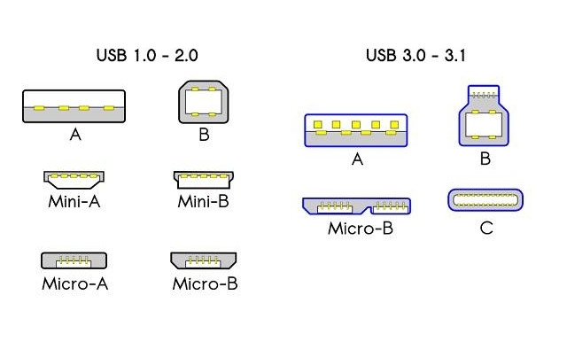

# 显示器接口

## DP接口

## HDMI接口

## DVI接口

## SVG接口

## VGA接口

# USB接口

## Type-Micro-A:

* 有方向要求，Type-Micro-B防误差性更好，故被淘汰
* 接口类似Type-Micro-B

## Type-Micro-B

* Type-Micro-B常用于过去的安卓手机

## Type-Mini-A

* 有方向要求，Type-Mini-B防误差性更好，故被淘汰
* 接口类似Type-Mini-B

## Type-Mini-B

* Type-Mini-B的USB2.0版常用于过去的电子设备，例如mp3,mp4,mp5等
* Type-Mini-B的USB3.0版常用于移动硬盘

## Type-A接口

* 最长见的标准usb接口
* 有方向要求

## Type-B接口

* Type-B接口常见于打印机

## Type-C接口

* Type-C接口体积较小
* Type-C还支持USB3.1标准
* Type-C标准供电最大100W
* Type-C体积最小
* Type-C正反可插。